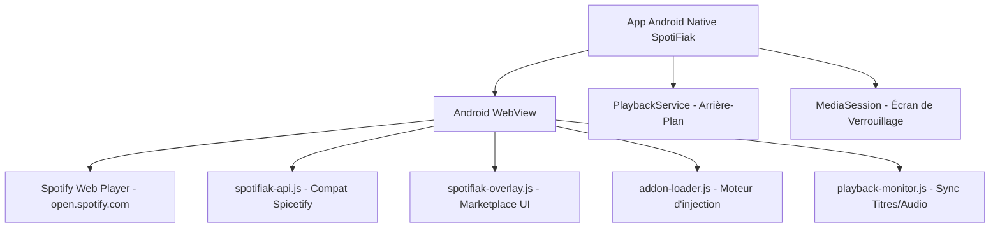

# 🎵 SpotiFiak — Spicetify pour Mobile

<p align="center">
  
</p>

<p align="center">
  <strong>L'expérience Spicetify adaptée pour téléphone : personnalisez Spotify Web Player avec des addons, thèmes et extensions communautaires. Inspiré de l'architecture native de SpotiDuck.</strong>
</p>

<p align="center">
  <a href="https://github.com/SatanMerde/SpotiFiak/releases/download/v1.0.0/SpotiFiak.apk">
    
  </a>
</p>

<p align="center">
  <a href="#-architecture-façon-spotiduck">Architecture</a> •
  <a href="#-téléchargement-et-installation-de-lapk">Télécharger l'APK</a> •
  <a href="#-marketplace--addons">Marketplace</a> •
  <a href="#-compatibilité-spicetify-pc">Compatibilité Spicetify</a> •
  <a href="#-compilation-de-lapk-avec-gradle">Compilation</a>
</p>

---

## 📱 Architecture façon SpotiDuck

Tout comme **[SpotiDuck](https://github.com/23fpsz/SpotiDuck-Releases)**, SpotiFiak fonctionne comme un **wrapper natif Android WebView** hautement optimisé autour du Spotify Web Player officiel (`open.spotify.com`) :

1. **WebView Container Haute Performance** :
   - Fait tourner Spotify Web Player en injectant un User-Agent Desktop optimisé tactile.
   - Contourne les limitations et restrictions mobiles habituelles.
2. **Injection Dynamique de Code (JS & CSS)** :
   - Injection au runtime des thèmes CSS et extensions JS sans modifier le binaire Spotify.
   - Interface flottante (FAB) injectée dans la page avec accès au Marketplace et aux réglages.
3. **Contrôles Système Natifs (MediaSession & Lock Screen)** :
   - Prise en charge des boutons média de l'écran de verrouillage Android (Play, Pause, Suivant, Précédent).
   - Affichage en direct du titre, artiste et pochette dans les notifications système.
4. **Lecture en Arrière-Plan Continue** :
   - Service d'avant-plan Android (`PlaybackService`) pour empêcher le système de suspendre la musique lorsque l'écran est éteint.



---

## 📥 Téléchargement et Installation de l'APK

### Méthode 1 : Via GitHub Actions (Recommandé)
Chaque commit ou release sur le repository déclenche automatiquement la compilation de l'APK via **GitHub Actions** :

1. Allez sur l'onglet **[Actions](https://github.com/SatanMerde/SpotiFiak/actions)** du dépôt.
2. Cliquez sur le dernier workflow exécuté (`Build SpotiFiak Android APK`).
3. Téléchargez l'artifact **`SpotiFiak-Release-APK`** ou **`SpotiFiak-Debug-APK`**.
4. Installez le fichier `.apk` sur votre téléphone Android (activez l'autorisation pour les sources inconnues si nécessaire).

### Méthode 2 : Version PWA Web
Pour tester immédiatement dans le navigateur :
```bash
git clone https://github.com/SatanMerde/SpotiFiak.git
cd SpotiFiak
npm install
npm run dev
# Ouvrir http://localhost:3000
```

---

## 🏪 Marketplace & Addons

Le Marketplace intégré permet d'installer en un clic :

| Catégorie | Description | Addons inclus par défaut |
|-----------|-------------|--------------------------|
| 🎨 **Thèmes** | Personnalisation visuelle complète | Midnight Wave, Aurora Borealis, Retro Synthwave |
| 🧩 **Extensions** | Ajout de fonctionnalités | Lyrics+, Audio Visualizer, Ad Skipper, Sleep Timer, Equalizer Pro |
| 📱 **Apps** | Interfaces enrichies | Stats Dashboard, Queue Manager+ |

---

## 🔗 Compatibilité Spicetify PC

SpotiFiak fournit une couche d'émulation pour `window.Spicetify` :

- `Spicetify.Player` : Contrôle de lecture (lecture, pause, piste suivante, volume).
- `Spicetify.CosmosAsync` : Requêtes asynchrones vers l'écosystème Spotify.
- `Spicetify.LocalStorage` : Stockage persistant des réglages d'addons.
- `Spicetify.PopupModal` & `Spicetify.showNotification` : Système de dialogues et notifications.
- `Spicetify.Topbar` & `Spicetify.ContextMenu` : Intégration de boutons et menus personnalisés.

Les extensions conçues pour la version PC de Spicetify s'exécutant sur le Web Player peuvent ainsi être activées directement sur votre téléphone.

---

## 🛠️ Compilation de l'APK avec Gradle

Si vous souhaitez compiler l'APK sur votre machine (avec JDK 17 et Android SDK) :

```bash
cd android
./gradlew assembleDebug      # Pour l'APK Debug
./gradlew assembleRelease    # Pour l'APK Release
```
L'APK généré se trouvera dans `android/app/build/outputs/apk/debug/app-debug.apk`.

---

## 📁 Organisation du Projet

```
SpotiFiak/
├── .github/
│   └── workflows/
│       └── build-apk.yml          # CI/CD compilation automatique de l'APK
├── android/
│   ├── app/
│   │   ├── src/main/
│   │   │   ├── AndroidManifest.xml
│   │   │   ├── java/com/spotifiak/app/
│   │   │   │   ├── MainActivity.java      # WebView + JS Bridge + MediaSession
│   │   │   │   └── PlaybackService.java   # Maintien lecture en arrière-plan
│   │   │   ├── assets/                    # Scripts & styles injectés
│   │   │   │   ├── js/spotifiak-api.js
│   │   │   │   ├── js/spotifiak-overlay.js
│   │   │   │   ├── js/addon-loader.js
│   │   │   │   ├── js/playback-monitor.js
│   │   │   │   └── css/mobile-fixes.css
│   │   │   └── res/                       # Icônes adaptatives, styles, sécurité
│   │   └── build.gradle
│   ├── gradlew / gradlew.bat
│   └── settings.gradle
├── addons/
│   ├── registry.json                      # Catalogue des addons disponibles
│   └── local/                             # Fichiers sources des addons
├── public/                                # Interface PWA de test
├── server.js                              # Serveur Express compagnon
└── package.json
```

---

## ⚠️ Avertissement Légal

Ce projet est un outil éducatif open-source non officiel. Il n'est en aucun cas affilié, sponsorisé ni approuvé par Spotify AB.

## 📄 Licence

MIT © [SatanMerde](https://github.com/SatanMerde)
