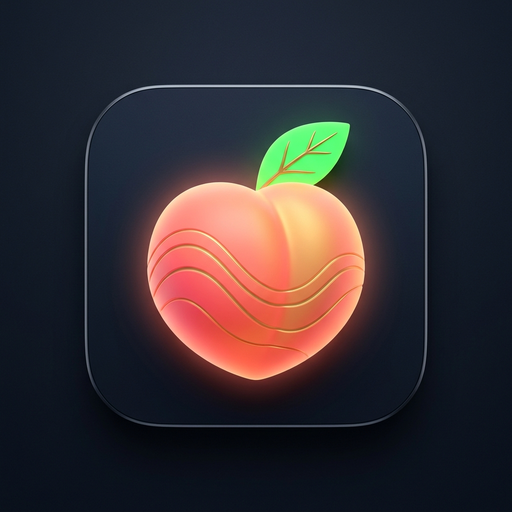
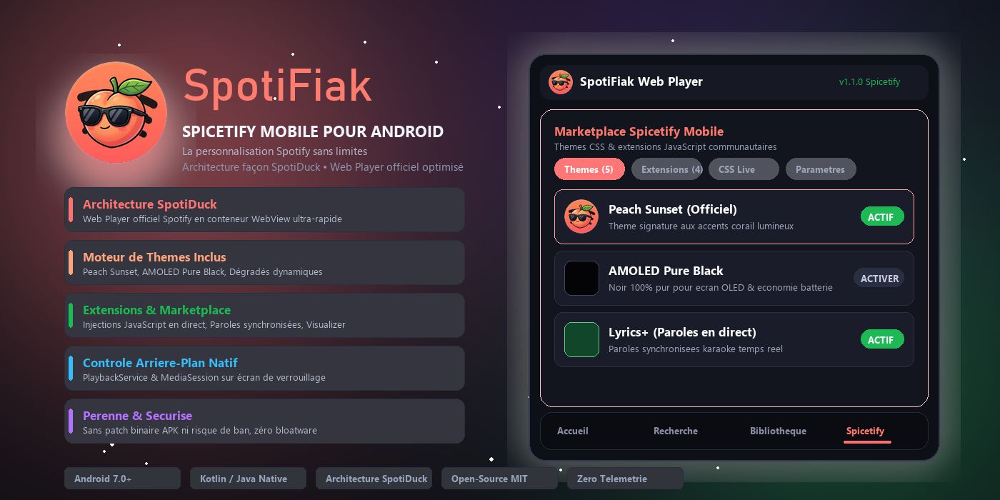
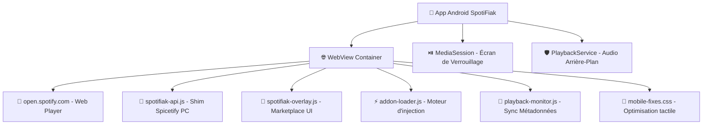

<div align="center">



# 🍑 SpotiFiak

### *Spicetify pour Android — Personnalisez Spotify Web Player sur Mobile*

[](https://github.com/SatanMerde/SpotiFiak/releases)
[](https://github.com/SatanMerde/SpotiFiak/actions)
[](https://github.com/SatanMerde/SpotiFiak/releases)
[](LICENSE)

<br/>

<a href="https://github.com/SatanMerde/SpotiFiak/releases/latest/download/SpotiFiak.apk">
  
</a>

<br/><br/>



<br/>

<p align="center">
  <a href="#-présentation">Présentation</a> •
  <a href="#-architecture-façon-spotiduck">Architecture</a> •
  <a href="#-fonctionnalités-clés">Fonctionnalités</a> •
  <a href="#-addons-inclus">Addons Inclus</a> •
  <a href="#-compatibilité-spicetify-pc">Compatibilité Spicetify</a> •
  <a href="#-installation--téléchargement">Installation</a> •
  <a href="#-compilation-source">Compilation</a>
</p>

</div>

---

## 🌟 Présentation

**SpotiFiak** est une application Android native open-source conçue pour apporter la puissance et la liberté de **Spicetify** sur téléphone mobile. 

Inspirée du concept technique de **[SpotiDuck](https://github.com/23fpsz/SpotiDuck-Releases)**, elle charge le **Spotify Web Player** officiel (`open.spotify.com`) au sein d'un container WebView Android ultra-rapide, tout en injectant dynamiquement des thèmes CSS, des extensions JavaScript communautaires, et une interface de personnalisation complète (Marketplace) accessible d'un simple toucher.

---

## 🏗️ Architecture façon SpotiDuck

Contrairement aux mods qui patchent l'APK binaire de Spotify et cassent à chaque mise à jour, **SpotiFiak** agit comme un environnement contrôlé autour de la version Web de Spotify :



### 💎 Pourquoi cette approche ?
1. **Mode Bureau Débloqué** : Injection d'un User-Agent Desktop adapté au tactile pour débloquer l'accès à la discographie complète sans les limitations de shuffle forcé de la version mobile.
2. **Contrôles Système Natifs** : Intégration de l'`Android MediaSession` pour afficher la pochette, le titre, l'artiste et piloter la lecture (Play, Pause, Skip) depuis l'écran de verrouillage et les écouteurs Bluetooth.
3. **Maintien de Lecture Écran Éteint** : Service d'avant-plan (`PlaybackService`) pour empêcher le système de suspendre le flux audio lorsque vous verrouillez votre téléphone.
4. **Injection à Chaud** : Vos thèmes et extensions s'activent et se désactivent instantanément via le bouton flottant (FAB), sans recharger l'application.

---

## ✨ Fonctionnalités Clés

- 🎧 **Spotify Web Player Intégré** : L'expérience Spotify complète, responsive et tactile.
- 🏪 **Marketplace Intégré** : Catalogue d'addons communautaires avec recherche instantanée, filtres et installation en un clic.
- 🎨 **Gestionnaire de Thèmes** : Personnalisation complète des couleurs et du design (dark mode, cyberpunk, synthwave, gradients).
- 🧩 **Extensions Pratiques** :
  - **Smart Ad Skipper** : Détection et passage automatique des interruptions publicitaires.
  - **Lyrics+** : Affichage d'un panneau flottant de paroles synchronisées.
  - **Audio Visualizer** : Visualiseur de spectre audio en direct.
  - **Sleep Timer** : Minuteur d'extinction automatique avec fondu sonore.
  - **Equalizer Pro** : Égaliseur audio 10 bandes.
- 🔗 **Couche d'Émulation Spicetify PC** : Support des APIs Spicetify classiques (`Spicetify.Player`, `Spicetify.CosmosAsync`, `Spicetify.LocalStorage`, `Spicetify.PopupModal`, `Spicetify.URI`).
- 🔄 **Mise à Jour In-App en 1 Clic** : Plus besoin de désinstaller l'application ni d'aller manuellement sur GitHub ! SpotiFiak détecte automatiquement les nouvelles versions, télécharge le nouvel APK et lance la mise à jour directement par-dessus votre installation sans perte de données.
- 🚀 **Zéro Compte Développeur Requis** : L'APK est compilé automatiquement par GitHub Actions à chaque version et téléchargeable librement.

---

## 📦 Addons Inclus (Disponibles Hors-Ligne)

SpotiFiak embarque nativement une sélection d'addons pré-installés dans l'APK :

| Type | Nom | Auteur | Compatibilité Spicetify PC | Description |
| :---: | :--- | :---: | :---: | :--- |
| 🍑 | **Peach Sunset** | SpotiFiak Team | Native CSS | Thème signature SpotiFiak aux accents pêche & corail lumineux |
| 🖤 | **AMOLED Pure Black** | OledDev | Native CSS | Noir 100% pur pour économiser la batterie sur écran OLED |
| 🎨 | **Midnight Wave** | SpotiFiak Team | Native CSS | Thème sombre avec accents néon bleus profonds |
| 🎨 | **Aurora Borealis** | NightCoder | Native CSS | Dégradés dynamiques violets et verts aurore |
| 🎨 | **Retro Synthwave** | VaporDev | Native CSS | Esthétique cyberpunk rétro 80s |
| 🧩 | **Lyrics+** | LyricsMaster | 🔗 Compatible | Paroles en direct synchronisées avec le morceau |
| 🧩 | **Audio Visualizer** | WaveForm | 🔗 Compatible | Barres de visualisation réactives au son |
| 🧩 | **Sleep Timer** | DreamDev | Autonome | Minuteur de sommeil avec extinction en douceur |
| 🧩 | **Equalizer Pro** | AudioTech | Web Audio | Égaliseur graphique multibandes |
| 📱 | **Stats Dashboard** | DataViz | 🔗 Compatible | Statistiques d'écoute et tendances |
| 📱 | **Queue Manager+** | QueueDev | 🔗 Compatible | Gestion avancée de la file d'attente |

---

## 🔗 Compatibilité Spicetify PC

SpotiFiak intègre un shim d'émulation pour exécuter les extensions PC Spicetify sur mobile :

```javascript
// Exemple d'extension Spicetify fonctionnant directement sur SpotiFiak
Spicetify.Player.addEventListener('songchange', (event) => {
    const track = Spicetify.Player.data.item;
    console.log('Piste en cours :', track.name, track.artists[0].name);
});
```

| API Spicetify | État SpotiFiak | Détails |
| :--- | :---: | :--- |
| `Spicetify.Player` | ✅ Complet | Play, pause, skip, écoute des événements |
| `Spicetify.CosmosAsync` | ✅ Émulé | GET, POST, PUT, DELETE via fetch |
| `Spicetify.LocalStorage` | ✅ Natif | Sauvegarde persistante des réglages |
| `Spicetify.PopupModal` | ✅ Émulé | Boîtes de dialogue adaptées à l'écran mobile |
| `Spicetify.showNotification`| ✅ Natif | Toasts Android natifs & bannières in-app |
| `Spicetify.Topbar` | ✅ Émulé | Boutons d'action dans l'overlay SpotiFiak |
| `Spicetify.URI` | ✅ Complet | Parsing d'URIs de pistes, albums et playlists |

---

## 📥 Installation & Téléchargement

### Télécharger l'APK
1. Téléchargez la dernière version depuis la page des **[Releases GitHub](https://github.com/SatanMerde/SpotiFiak/releases)** ou via le lien direct :  
   👉 **[Télécharger SpotiFiak.apk](https://github.com/SatanMerde/SpotiFiak/releases/download/v1.0.0/SpotiFiak.apk)**
2. Ouvrez le fichier téléchargé sur votre smartphone Android.
3. Activez l'installation depuis des sources inconnues si Android vous le demande.
4. Lancez **SpotiFiak** et profitez de l'expérience !

---

## 🛠️ Compilation Source

Si vous souhaitez compiler l'APK sur votre propre ordinateur :

### Prérequis
- [Java JDK 17](https://adoptium.net/)
- Android SDK (Plateforme 34, Build Tools 34.0.0)

### Commandes
```bash
# Cloner le dépôt
git clone https://github.com/SatanMerde/SpotiFiak.git
cd SpotiFiak

# Compilation avec Gradle Wrapper
./gradlew assembleDebug

# L'APK compilé se trouve dans :
# app/build/outputs/apk/debug/app-debug.apk
```

---

## 📁 Structure du Projet

```
SpotiFiak/
├── .github/
│   └── workflows/
│       └── build-apk.yml          # CI/CD compilation & publication automatique
├── app/
│   ├── build.gradle               # Configuration Gradle du module app (SDK 34)
│   ├── proguard-rules.pro         # Règles Proguard
│   └── src/main/
│       ├── AndroidManifest.xml    # Permissions, MediaSession & PlaybackService
│       ├── java/com/spotifiak/app/
│       │   ├── MainActivity.java      # WebView native + bridge JS + MediaSession
│       │   └── PlaybackService.java   # Maintien du son en arrière-plan
│       ├── assets/                    # Moteur SpotiFiak injecté
│       │   ├── js/spotifiak-api.js        # Couche d'émulation Spicetify PC
│       │   ├── js/spotifiak-overlay.js    # Interface mobile du Marketplace
│       │   ├── js/addon-loader.js         # Moteur de chargement des addons
│       │   ├── js/playback-monitor.js     # Synchronisation audio/titres
│       │   ├── css/mobile-fixes.css       # Optimisations tactiles mobiles
│       │   └── addons/                    # 10 addons embarqués hors-ligne
│       └── res/                       # Icônes vectorielles, thèmes, styles
├── addons/                            # Dépôt pour les contributions communautaires
│   ├── registry.json                  # Catalogue centralisé des addons
│   └── local/                         # Fichiers sources des thèmes et extensions
├── build.gradle                       # Build script racine
├── settings.gradle                    # Configuration des modules
├── gradle.properties                  # Paramètres JVM et AndroidX
├── CONTRIBUTING.md                    # Guide pour créer et proposer des addons
├── LICENSE                            # Licence MIT
└── README.md
```

---

## 🤝 Contribution

Les contributions pour ajouter de nouveaux thèmes ou extensions sont les bienvenues ! Consultez le fichier [CONTRIBUTING.md](CONTRIBUTING.md) pour apprendre à structurer votre addon et soumettre une Pull Request.

---

## ⚠️ Avertissement Légal

Ce projet est un projet **éducatif, open-source et expérimental**. Il n'est **ni affilié, ni sponsorisé, ni approuvé par Spotify AB**.

- 🔒 **Aucune donnée personnelle collectée** — Zéro tracking, zéro analytics, zéro telemetry
- 📜 **Aucun contenu protégé modifié** — SpotiFiak ne télécharge, ne copie et ne redistribue aucun contenu musical
- 🚫 **Aucun DRM contourné** — La lecture audio est gérée intégralement par le lecteur web de Spotify
- ⚖️ **Usage personnel uniquement** — L'utilisateur est responsable du respect des CGU de Spotify

Toutes les marques déposées appartiennent à leurs propriétaires respectifs. « Spotify » est une marque déposée de Spotify AB.

📄 **Documents légaux complets :**
- [📜 Informations Légales](docs/LEGAL.md) — Conditions d'utilisation, non-affiliation, propriété intellectuelle
- [🔒 Politique de Confidentialité](docs/PRIVACY.md) — Zéro collecte de données, permissions Android, stockage local

---

## 📋 Licence

SpotiFiak est distribué sous la **[Licence MIT](LICENSE)** — libre d'utilisation, de modification et de redistribution.

---

<div align="center">
  <b>SpotiFiak</b> 🍑 — Développé avec ❤️ par <a href="https://github.com/SatanMerde">SatanMerde</a><br/>
  <sub>Projet open-source éducatif • Non affilié à Spotify AB • 2026</sub>
</div>
